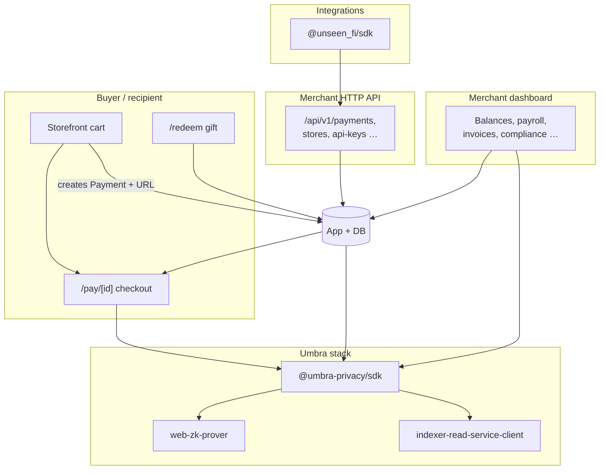
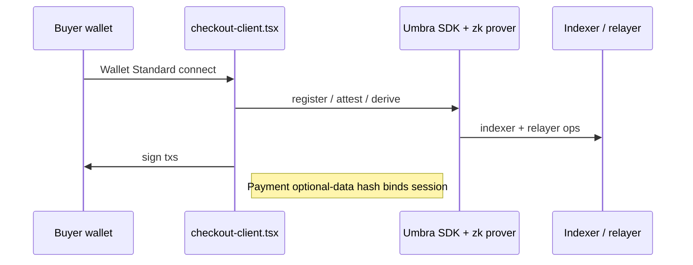

[](https://unseen.finance)

# Unseen Finance (`unseen_app`)

This **[Next.js](https://nextjs.org)** application is the hosted **Unseen Finance** stack: merchants get **payments, storefronts, invoices, payroll, gift cards / tip-linked flows, compliance, auditing**, and the **merchant dashboard**. Confidential settlement primitives come from **[Umbra](https://www.npmjs.com/package/@umbra-privacy/sdk)** (`@umbra-privacy/sdk`, `@umbra-privacy/web-zk-prover`, `@umbra-privacy/indexer-read-service-client` — see [`package.json`](./package.json)).

Merchant **REST** integrations ship as **`@unseen_fi/sdk`** — source [**github.com/tsmboa0/unseen-sdk**](https://github.com/tsmboa0/unseen-sdk) (npm: [`@unseen_fi/sdk`](https://www.npmjs.com/package/@unseen_fi/sdk)). This README is the **in-repo map** for `unseen_app`: every major product surface, how it relates to Umbra (**direct imports** vs **indirect via `/pay/[id]` checkout**), and **exact file paths** to implementations.

---

## Links

| Resource | URL |
| -------- | --- |
| Product | [unseen.finance](https://unseen.finance) |
| Documentation | [docs.unseen.finance](https://docs.unseen.finance) |
| Server SDK | [GitHub `tsmboa0/unseen-sdk`](https://github.com/tsmboa0/unseen-sdk) · [npm `@unseen_fi/sdk`](https://www.npmjs.com/package/@unseen_fi/sdk)|
| React Pay UI | [npm `@unseen_fi/ui`](https://www.npmjs.com/package/@unseen_fi/ui) |

---

## Why we built Unseen Finance — full product footprint

Traditional Solana flows are optimized for **on-chain transparency**. Teams that still need **simple merchant UX**, **API-driven checkout**, and **regulated / confidential disclosure** normally assemble wallets, SPL, indexers, and privacy crates themselves.

Unseen concentrates that into **one merchant OS**:

| Capability | What it is (in `unseen_app`) |
| ---------- | --------------------------- |
| **Unseen Pay** | API keys (`/api/v1/...`): create payments, verify, webhooks, tx metadata. |
| **Hosted checkout** | Buyer-facing **`/pay/[paymentId]`** — Wallet Standard + Umbra registration + payer proofs. |
| **Gateway** | Dashboard workspace for merchant **payment-session** posture (activity + tooling); pairs with Pay API below. |
| **Storefronts** | Hosted **store** subdomain routes + catalog/cart/checkout that mint **payment + checkout URLs**. |
| **Invoices** | Issue invoices with **checkout links**; email + PDF; settlement path is the shared pay page when customer pays. |
| **Payroll** | Bulk **USDC/USDT** runs: client-side Umbra (Privy) and/or **server-side** Umbra deposits via Privy authorization. |
| **Gift cards & tip flows** | Merchants fund treasuries; recipients **redeem** codes; Umbra-assisted **claim/UTXO** path server-side (`umbra-gift-payout`). |
| **Compliance** | **Mint- and time-scoped** viewing keys, **auditor grants**, disclosures + PDFs wired to Umbra crypto APIs. |
| **Auditor (public tooling)** | No-login PDF from disclosed viewing key + mint + window — indexer-backed Mixer UTXO metadata. |
| **Dashboard hub** | Balances / activity mesh with **Umbra scan/claim**, registration banner, and product shortcuts. |
| **API keys & settings** | Key lifecycle for Unseen Pay; merchant settings. |

**Strategic Umbra placement:** Umbra APIs run **inside the browser wallet flow** (`checkout-client`, **`useUmbraPrivateActions`**) and **on trusted servers** (payroll Umbra deposits, gift claim orchestration). Surfaces like **invoice** and **storefront checkout** funnel into **`/pay/...`**; they do **not** reimplement Umbra in their own folders.

---

## Problem, audience, use cases

| Dimension | Detail |
| --------- | ------ |
| **Problem** | Merchants need consolidated **payments + ops** on Solana, with optional **privacy-aligned** payer settlement (Umbra) and **auditability** (scoped keys + indexer PDFs)—without assembling each layer. |
| **Audience** | **Merchants** (Privy/dashboard), **payers**, **integrations** (`@unseen_fi/sdk`), **developers** cloning this repo, **third-party auditors**. |
| **Use cases** | Pay links, storefront checkout, invoicing, scheduled payroll pushes, gifting, compliance packets, indexer-backed auditor reports. |

---

## Architecture (multi-surface)



---

## Build, run, test

From **`unseen_app/`**:

```bash
npm install
# Configure DATABASE_URL and env (.env.example if present).
npx prisma migrate dev   # or: npm run db:push
npm run db:seed          # optional
npm run dev              # http://localhost:3000
npm run build && npm run start   # production mode
npm run lint
```

**Maintenance scripts:** `umbra:test-registration`, `privy:gen-payroll-auth-key`, `gift:sync-admin-env`, `umbra:log-encrypted-balances`, etc. — see [`package.json`](./package.json).

**SDK smoke harness (optional):** from [the SDK repo](https://github.com/tsmboa0/unseen-sdk) or `../packages/unseen-sdk` in this monorepo → `npm run build` then `node test/smoke.js` against your running API.

---

## Deployed fronts & checkout URLs

| Surface | Typical / configured URL |
| ------- | ------------------------ |
| Marketing | [unseen.finance](https://unseen.finance) |
| Docs | [docs.unseen.finance](https://docs.unseen.finance) |

The merchant dashboard is served by the **same deployed Next.js app** as checkout; configure your production host accordingly ( **`CHECKOUT_BASE_URL`** drives absolute pay links).

Checkout links are **`${CHECKOUT_BASE_URL}/pay/${paymentId}`**, assembled in [`app/api/v1/payments/route.ts`](./app/api/v1/payments/route.ts) (same pattern in store checkout routes).

**Umbra program IDs:** taken from Umbra deployments / SDK for your cluster—**not duplicated here**. Use Umbra official deployment docs plus your infra env pins.

---

## Product surfaces × Umbra (implementation map)

Below, **every bullet is a repo path relative to `unseen_app/`** (folders use trailing `/`).  
Legend: **Umbra-Direct** = imports `@umbra-privacy/*` in that file subtree. **Umbra-Via-Pay** = creates or opens a **`/pay/...`** session; payer Umbra logic lives under **Hosted checkout**.

### 1. Unseen Pay — merchant REST API (`/api/v1`)

**Role:** Merchant server creates **payments**, lists/gets/cancels, submits tx hints, verifies. Consumed by **`@unseen_fi/sdk`** (`UnseenClient`).

| Path | Role |
|------|------|
| [`app/api/v1/payments/route.ts`](./app/api/v1/payments/route.ts) | `POST` create payment (**`checkoutUrl`**), `GET` list |
| [`app/api/v1/payments/[id]/route.ts`](./app/api/v1/payments/%5Bid%5D/route.ts) | `GET` / `DELETE` single payment |
| [`app/api/v1/payments/[id]/verify/route.ts`](./app/api/v1/payments/%5Bid%5D/verify/route.ts) | Settlement verification backend |
| [`app/api/v1/payments/[id]/submit-tx/route.ts`](./app/api/v1/payments/%5Bid%5D/submit-tx/route.ts) | Associate submitted signatures |
| [`app/api/v1/payments/[id]/tx-sigs/route.ts`](./app/api/v1/payments/%5Bid%5D/tx-sigs/route.ts) | Read tx signatures |
| [`app/api/v1/upload/route.ts`](./app/api/v1/upload/route.ts) | Supporting upload endpoint for integrations |
| [`app/api/v1/merchants/me/route.ts`](./app/api/v1/merchants/me/route.ts) | Merchant profile (SDK `me()` target) |

**Umbra:** **Indirect** — payer runs Umbra on **[Hosted checkout (§2)](#2-hosted-checkout-paypaymentid-buyer-pays)** once they open **`checkoutUrl`**.

---

### 2. Hosted checkout — `/pay/[paymentId]` (buyer pays)

**Role:** Buyer connects wallet (**Wallet Standard**), runs **Umbra registration** (+ master-seed onboarding), submits **ZK-backed** payer flow bound to **`expectedOptionalDataHash`** for that payment session.

#### Umbra-Direct implementation files

| Path | Role |
|------|------|
| [`app/pay/[paymentId]/checkout-client.tsx`](./app/pay/%5BpaymentId%5D/checkout-client.tsx) | Main Umbra + prover orchestration (`@umbra-privacy/sdk`, `@umbra-privacy/web-zk-prover`, registration UX) |
| [`app/pay/[paymentId]/page.tsx`](./app/pay/%5BpaymentId%5D/page.tsx) | Server wrapper that loads checkout client |
| [`lib/umbra/master-seed-storage.ts`](./lib/umbra/master-seed-storage.ts) | Browser master-seed storage adapter for Umbra client deps (`GetUmbraClientDeps`) |
| [`lib/solana-endpoints.ts`](./lib/solana-endpoints.ts) | RPC + **`getDefaultUmbraIndexerUrl`** (shared across checkout, dashboard server paths) |



---

### 3. Merchant-dashboard Umbra primitives (shared hook + APIs)

**Central hook:**

| Path | Role |
|------|------|
| [`hooks/use-umbra-private-actions.ts`](./hooks/use-umbra-private-actions.ts) | Umbra **`getUmbraClient`**, scanners, deposits/withdraws to claimables, **`getUmbraRelayer`**, compliance **`getComplianceGrantIssuerFunction`**, viewing-key derivation (`sdk/crypto`), `web-zk-prover` provers, Persists scanned UXOs via dashboard APIs |

**Signers / storage:**

| Path | Role |
|------|------|
| [`lib/umbra/privy-signer.ts`](./lib/umbra/privy-signer.ts) | `createSignerFromWalletAccount` wiring for Privy Solana wallets |
| [`lib/umbra/master-seed-storage.ts`](./lib/umbra/master-seed-storage.ts) | Merchant-side master seed (dashboard) aligned with Umbra deps |
| [`components/dashboard/umbra-registration-banner.tsx`](./components/dashboard/umbra-registration-banner.tsx) | Inline **registration** UX using `@umbra-privacy/sdk` + **`getUserRegistrationProver`** |

**Dashboard APIs used by scans / persisted UXOs:**

| Path | Role |
|------|------|
| [`app/api/dashboard/umbra-utxos/route.ts`](./app/api/dashboard/umbra-utxos/route.ts) | Sync claimable UXO inventory from client scans |
| [`app/api/dashboard/umbra-scan-cursor/route.ts`](./app/api/dashboard/umbra-scan-cursor/route.ts) | Cursor persistence for Umbra indexer scans |
| [`app/api/dashboard/umbra-registration/route.ts`](./app/api/dashboard/umbra-registration/route.ts) | Server records **merchant Umbra registration** state |

---

### 4. Merchant dashboard — home hub

**Role:** KPIs, product mix (**gateway, payroll, storefronts, invoices, tip/gift**, x402-aware labels where applicable — see [`dashboard/page.tsx`](./app/dashboard/page.tsx) **`PRODUCT_LABELS`**), onboarding to treasury widgets.

#### Umbra-Direct UI entry

| Path | Role |
|------|------|
| [`app/dashboard/page.tsx`](./app/dashboard/page.tsx) | Embeds **`UmbraRegistrationBanner`**, treasury-style dashboard |
| [`components/dashboard/umbra-registration-banner.tsx`](./components/dashboard/umbra-registration-banner.tsx) | **Umbra registration** UX (duplicate pointer from [§3](#3-merchant-dashboard-umbra-primitives-shared-hook--apis) for auditors navigating from Dashboard) |

**Umbra:** **Mixed** — **Direct** banner + downstream pages (**payroll**, **compliance**) call **`useUmbraPrivateActions`**.

---

### 5. Gateway (dashboard workspace)

**Role:** Merchant view of **Gateway**-classified payment activity (**shielded**, pending, failures) aligned with **`useDashboardOverview`**; aligns product narrative (“Payment sessions, checkout, and settlement”). Programmatic checkout creation remains **[Unseen Pay §1](#1-unseen-pay--merchant-rest-api-apiv1)**.

| Path | Role |
|------|------|
| [`app/dashboard/gateway/page.tsx`](./app/dashboard/gateway/page.tsx) | Gateway KPIs + session table UX (`formPrivacy` distinguishes **shielded** vs plain presentation) |

**Umbra:** **Indirect** — shielded payer experience is **`checkout-client.tsx`** ([§2](#2-hosted-checkout-paypaymentid-buyer-pays)).

---

### 6. Storefronts (hosted stores + merchant admin)

**Role:** Merchant CRUD **`/api/v1/stores`**, **`/products`**, subdomain **`/store/[slug]`** storefront, **`/store/[slug]/cart`** checkout that creates a **payment** row and returns **`checkoutUrl`**.

#### Storefront-facing UI

| Path | Role |
|------|------|
| [`app/store/[slug]/page.tsx`](./app/store/%5Bslug%5D/page.tsx) | Public storefront index |
| [`app/store/[slug]/[productId]/page.tsx`](./app/store/%5Bslug%5D/%5BproductId%5D/page.tsx) | Product detail |
| [`app/store/[slug]/cart/page.tsx`](./app/store/%5Bslug%5D/cart/page.tsx) | Cart + redirect to **`checkoutUrl`** |

#### HTTP — public + merchant APIs

| Path | Role |
|------|------|
| [`app/api/public/stores/[slug]/checkout/route.ts`](./app/api/public/stores/%5Bslug%5D/checkout/route.ts) | Creates payment + **`${checkoutBaseUrl}/pay/:id`** |
| [`app/api/public/stores/[slug]/route.ts`](./app/api/public/stores/%5Bslug%5D/route.ts) | Public store metadata |
| [`app/api/public/stores/[slug]/products/route.ts`](./app/api/public/stores/%5Bslug%5D/products/route.ts) | Public catalog |
| [`app/api/v1/stores/route.ts`](./app/api/v1/stores/route.ts) | Merchant list/create stores |
| [`app/api/v1/stores/[storeId]/route.ts`](./app/api/v1/stores/%5BstoreId%5D/route.ts) | Merchant store mutation |
| [`app/api/v1/stores/[storeId]/products/route.ts`](./app/api/v1/stores/%5BstoreId%5D/products/route.ts) | Product collection |
| [`app/api/v1/stores/[storeId]/products/[productId]/route.ts`](./app/api/v1/stores/%5BstoreId%5D/products/%5BproductId%5D/route.ts) | Single product CRUD |
| [`app/api/v1/stores/[storeId]/orders/route.ts`](./app/api/v1/stores/%5BstoreId%5D/orders/route.ts) | Orders |
| [`app/api/v1/stores/[storeId]/orders/[orderId]/route.ts`](./app/api/v1/stores/%5BstoreId%5D/orders/%5BorderId%5D/route.ts) | Order detail |

#### Dashboard admin UX

| Path | Role |
|------|------|
| [`app/dashboard/storefronts/page.tsx`](./app/dashboard/storefronts/page.tsx) | Store list / management |
| [`app/dashboard/storefronts/[storeId]/page.tsx`](./app/dashboard/storefronts/%5BstoreId%5D/page.tsx) | Deep link store admin |

**Umbra:** **Via-Pay** — payer hits **[§2](#2-hosted-checkout-paypaymentid-buyer-pays)** unless you only use **transparent** wording in marketing; infra still routes shielded payouts through Umbra-backed checkout logic.

---

### 7. Invoices

**Role:** Merchant issues invoices; customer receives **checkout URL** (optionally **`?ref=invoice`** routing in [`lib/invoice/invoice-pay-url.ts`](./lib/invoice/invoice-pay-url.ts)); PDF + email pipelines.

#### UI + APIs + libs

| Path | Role |
|------|------|
| [`app/dashboard/invoice/page.tsx`](./app/dashboard/invoice/page.tsx) | Merchant invoice workspace |
| [`app/api/dashboard/invoices/route.ts`](./app/api/dashboard/invoices/route.ts) | Create/list/update invoice records |
| [`app/api/dashboard/invoices/[id]/pdf/route.ts`](./app/api/dashboard/invoices/%5Bid%5D/pdf/route.ts) | Invoice PDF |
| [`app/api/dashboard/invoices/next-number/route.ts`](./app/api/dashboard/invoices/next-number/route.ts) | Next invoice numbering |
| [`lib/invoice/invoice-pay-url.ts`](./lib/invoice/invoice-pay-url.ts) | Relative pay path + query ref helper |
| [`lib/invoice/send-invoice-email.ts`](./lib/invoice/send-invoice-email.ts), [`lib/invoice/invoice-email-html.ts`](./lib/invoice/invoice-email-html.ts) | Outbound invoice email |

**Umbra:** **Via-Pay** — payer completes **[Hosted checkout §2](#2-hosted-checkout-paypaymentid-buyer-pays)**.

---

### 8. Payroll — bulk disbursement (direct Umbra deposits + Privy delegation)

**Role:** Merchants assemble **CSV/manual** recipient lists (**USDC / USDT**), run **delegated server signing** batches: **Privy authorization** builds **server Umbra client** performing **`getPublicBalanceToEncryptedBalanceDirectDepositorFunction`** sequentially per recipient. Client UI also validates **`canUseUmbraActions`** ( **`useUmbraPrivateActions`**) prior to delegated runs.

#### Umbra-Direct orchestration & Privy bridging

| Path | Role |
|------|------|
| [`lib/payroll/server-umbra-deposit.ts`](./lib/payroll/server-umbra-deposit.ts) | **`createPayrollServerUmbraClient`**, **`depositPublicToRecipientEtaServer`** (Umbra direct deposit callable) |
| [`lib/umbra/privy-server-signer.ts`](./lib/umbra/privy-server-signer.ts) | `IUmbraSigner` wired to **Privy server** signer (used by payroll client builder) |

#### Payroll support modules (auth & constants)

| Path | Role |
|------|------|
| [`lib/payroll/constants.ts`](./lib/payroll/constants.ts) | Payroll mint/decimals/helpers |
| [`lib/payroll/privy-app-authorization.ts`](./lib/payroll/privy-app-authorization.ts), [`lib/payroll/resolve-privy-wallet-id.ts`](./lib/payroll/resolve-privy-wallet-id.ts), [`lib/payroll/privy-solana-policy.ts`](./lib/payroll/privy-solana-policy.ts), [`lib/payroll/bearer.ts`](./lib/payroll/bearer.ts) | Privy + wallet quorum plumbing |

#### UI + APIs

| Path | Role |
|------|------|
| [`app/dashboard/payroll/page.tsx`](./app/dashboard/payroll/page.tsx) | Full payroll wizard; sequential client pacing (**`useUmbraPrivateActions`** prerequisite); delegated server flow kicks **`runs/prepare`** + signer consent UX |
| [`app/api/dashboard/payroll/runs/route.ts`](./app/api/dashboard/payroll/runs/route.ts) | `POST` — create/import a full payroll run snapshot (alternate to **`prepare`** flow depending on UX path) |
| [`app/api/dashboard/payroll/runs/prepare/route.ts`](./app/api/dashboard/payroll/runs/prepare/route.ts) | Prepare delegated run payloads |
| [`app/api/dashboard/payroll/runs/[id]/execute/route.ts`](./app/api/dashboard/payroll/runs/%5Bid%5D/execute/route.ts) | Executes pending items via **`depositPublicToRecipientEtaServer`** (guards **`merchant.umbraRegistered`**) |
| [`app/api/dashboard/payroll/signer-consent/route.ts`](./app/api/dashboard/payroll/signer-consent/route.ts) | Payroll delegation consent handshake |

**Umbra:** **Direct server + client prerequisites** ([`server-umbra-deposit.ts`](./lib/payroll/server-umbra-deposit.ts), **`useUmbraPrivateActions`**, signer helpers).

---

### 9. Gift cards, treasury funding, redemption (`/redeem`) — Umbra-assisted claims

**Role:** Merchant **creates gift intent** (**dashboard › Tip links tab** merges **gift cards** + tipping UX), confirms SPL funding (**Privy-transfer** toolkit), recipients **lookup + claim** on **`/redeem`**. Claims execute **`createAndClaimSelfGiftUtxo`** in **`umbra-gift-payout`** (admin Umbra signer, registration scanners, **`getUmbraRelayer`**, provers).

#### Umbra-Direct lib + scripts

| Path | Role |
|------|------|
| [`lib/gift-cards/umbra-gift-payout.ts`](./lib/gift-cards/umbra-gift-payout.ts) | Umbra scanners, **`getPublicBalanceToSelfClaimableUtxoCreatorFunction`**, **`createAndClaimSelfGiftUtxo`**, relayer + prover wiring |
| [`lib/gift-cards/admin-wallet.ts`](./lib/gift-cards/admin-wallet.ts) | **`createSignerFromPrivateKeyBytes`** for gift admin Hot wallet |
| [`scripts/sync-gift-admin-env.ts`](./scripts/sync-gift-admin-env.ts) | Dev script importing **`createSignerFromPrivateKeyBytes`** for admin env validation |

#### Supporting gift libraries (funding / codes / cursors)

| Path | Role |
|------|------|
| [`lib/gift-cards/privy-fund-treasury-transfer.ts`](./lib/gift-cards/privy-fund-treasury-transfer.ts) | Merchant wallet SPL funding into treasury |
| [`lib/gift-cards/verify-spl-funding.ts`](./lib/gift-cards/verify-spl-funding.ts) | Confirms treasury receipt |
| [`lib/gift-cards/claim-code.ts`](./lib/gift-cards/claim-code.ts) | Claim normalization + hashing |
| [`lib/gift-cards/public-gift-claim-cursor.ts`](./lib/gift-cards/public-gift-claim-cursor.ts) | Recipient claim bookkeeping |
| [`lib/gift-cards/constants.ts`](./lib/gift-cards/constants.ts) | Shared constants |

#### UI + APIs

| Path | Role |
|------|------|
| [`app/dashboard/tiplinks/page.tsx`](./app/dashboard/tiplinks/page.tsx) | Merchant UI: **gift card issuance** + treasury funding + ancillary **tip link** tooling (gift path hits **`gift-cards/intent`**) |
| [`app/redeem/page.tsx`](./app/redeem/page.tsx) | Public wallet UI for **lookup + POST claim** (`/api/public/gift-cards/claim`) |
| [`app/api/dashboard/gift-cards/intent/route.ts`](./app/api/dashboard/gift-cards/intent/route.ts), [`app/api/dashboard/gift-cards/confirm/route.ts`](./app/api/dashboard/gift-cards/confirm/route.ts) | Issuer flow |
| [`app/api/public/gift-cards/lookup/route.ts`](./app/api/public/gift-cards/lookup/route.ts), [`app/api/public/gift-cards/claim/route.ts`](./app/api/public/gift-cards/claim/route.ts) | Recipient lookup / **`createAndClaimSelfGiftUtxo`** trigger |

**Umbra:** **Direct server + admin signer** (`umbra-gift-payout`, `admin-wallet.ts`); payer funding leg uses **transparent SPL transfer** primitives before Umbra-backed claim choreography.

---

### 10. Compliance — viewing keys & auditor grants (dashboard)

**Role:** Disclosure UX: derives **scoped viewing keys**, issues **auditor grants**, persists structured reports + PDF renders describing Umbra-aligned disclosure payloads.

#### Umbra-Direct UI + cryptographic helpers

| Path | Role |
|------|------|
| [`app/dashboard/compliance/page.tsx`](./app/dashboard/compliance/page.tsx) | Grants + viewing-key panels calling **`useUmbraPrivateActions`** |
| [`lib/compliance/viewing-key-hex.ts`](./lib/compliance/viewing-key-hex.ts) | BN254 Poseidon scoped key exporters (uses **`BN254_FIELD_PRIME`** mapping) |
| [`lib/compliance/umbra-keys.ts`](./lib/compliance/umbra-keys.ts) | X25519 / nonce bridging utilities used by Umbra grant flows |

#### PDF templates (Umbra language + disclosure copy)

| Path | Role |
|------|------|
| [`lib/compliance/pdf/compliance-report-pdf.tsx`](./lib/compliance/pdf/compliance-report-pdf.tsx) | Disclosure PDF JSX |
| [`lib/compliance/pdf/auditor-viewing-key-report-pdf.tsx`](./lib/compliance/pdf/auditor-viewing-key-report-pdf.tsx) | Auditor-shareable textual framing referencing Umbra metadata |

#### HTTP surface

| Path | Role |
|------|------|
| [`app/api/dashboard/compliance/scoped-viewing-keys/route.ts`](./app/api/dashboard/compliance/scoped-viewing-keys/route.ts) | Persist derived keys metadata |
| [`app/api/dashboard/compliance/grants/route.ts`](./app/api/dashboard/compliance/grants/route.ts) | Persist compliance grants |
| [`app/api/dashboard/compliance/reports/route.ts`](./app/api/dashboard/compliance/reports/route.ts), [`reports/[id]/pdf/route.ts`](./app/api/dashboard/compliance/reports/%5Bid%5D/pdf/route.ts) | Report blobs + downloadable PDF |

**Umbra:** **Direct** via **`useUmbraPrivateActions`** + cryptographic utilities above.

---

### 11. Auditor tooling (loginless `/auditor`)

**Role:** Builds **mixer UTXO PDF** from voluntarily disclosed **`viewingKeyHex` + mint + UTC interval** leveraging **Indexer read service**.

#### Umbra-Direct engine + viewer

| Path | Role |
|------|------|
| [`lib/auditor/indexer-utxo-report.ts`](./lib/auditor/indexer-utxo-report.ts) | **`ReadServiceClient`** data shaping for PDF payloads |
| [`lib/auditor/viewing-key-hex.ts`](./lib/auditor/viewing-key-hex.ts) | Validates Umbra-exported BN254-viewing-key strings |
| [`app/api/public/auditor/viewing-key-report/route.ts`](./app/api/public/auditor/viewing-key-report/route.ts) | POST → PDF stream (uses **`getDefaultUmbraIndexerUrl`** for network-relative indexer endpoints) |

#### Frontend

| Path | Role |
|------|------|
| [`app/auditor/page.tsx`](./app/auditor/page.tsx), [`auditor-report-form.tsx`](./app/auditor/auditor-report-form.tsx) | Public entry + client fetch to **`/api/public/auditor/viewing-key-report`** |

**Umbra:** **Direct indexer client** dependency + aligned PDF templates.

---

### 12. API keys, onboarding, miscellaneous dashboard routes

**Role:** Key lifecycle (**Unseen Pay**), **`/dashboard/onboarding`** data, aggregator feeds.

| Path | Role |
|------|------|
| [`app/dashboard/api-keys/page.tsx`](./app/dashboard/api-keys/page.tsx) | UX for managing **`usk_*`** keys |
| [`app/api/v1/api-keys/route.ts`](./app/api/v1/api-keys/route.ts), [`[keyId]/route.ts`](./app/api/v1/api-keys/%5BkeyId%5D/route.ts) | REST key issuance & revocation |
| [`app/api/dashboard/onboarding/route.ts`](./app/api/dashboard/onboarding/route.ts) | Progressive onboarding payloads |
| [`app/api/dashboard/me/route.ts`](./app/api/dashboard/me/route.ts) | Merchant **`me`** for dashboard shells |
| [`app/api/dashboard/overview/route.ts`](./app/api/dashboard/overview/route.ts) | Aggregated metrics powering multiple dashboard pages (**gateway**, **gift**, invoice rollups etc.) |

**Umbra:** Usually **none** in these handlers—merchant Umbra onboarding state feeds via **`merchant.umbraRegistered`** and **`/api/dashboard/umbra-registration`** ([§3](#3-merchant-dashboard-umbra-primitives-shared-hook--apis)).

---

### 13. Marketing / product stubs (no Umbra in-page code)

Landing + upcoming **named products** (**Gateway, storefront, x402** demos):

| Path | Role |
|------|------|
| [`app/page.tsx`](./app/page.tsx), [`components/unseen/landing-page.tsx`](./components/unseen/landing-page.tsx), [`products/[slug]/page.tsx`](./app/products/%5Bslug%5D/page.tsx) | Marketing placeholders / hero demos (**`x402`** interactive demo components under [`components/unseen/demos/`](./components/unseen/demos/), [`hero-demos/`](./components/unseen/hero-demos/) ) |

These routes **tell the story**; **Umbra execution** remains behind dashboard + checkout implementations above once users ship real traffic.

---

## Security reminders

1. **`usk_*`** API keys belong **only** on trusted backends (`@unseen_fi/sdk` consumers).
2. **Buyer & Umbra master-seed artifacts** remain **browser-local** [`master-seed-storage.ts`](./lib/umbra/master-seed-storage.ts) patterns—avoid exfiltration through bespoke merchant backends.
3. **Gift admin keys** [`admin-wallet.ts`](./lib/gift-cards/admin-wallet.ts) & **Privy payroll auth** [`privy-app-authorization.ts`](./lib/payroll/privy-app-authorization.ts) are **high-value secrets** — load exclusively from guarded env (`PRIVY_APP_AUTHORIZATION_*`, vault storage).
4. **Webhook ingestion** MUST verify **`X-Unseen-Signature`** using raw POST bodies (**pattern:** [`packages/unseen-sdk/src/webhooks.ts`](../packages/unseen-sdk/src/webhooks.ts)).

---

## Reference — every file that imports Umbra npm packages *(generated map)*

| Path | Imports |
|------|---------|
| [`app/pay/[paymentId]/checkout-client.tsx`](./app/pay/%5BpaymentId%5D/checkout-client.tsx) | `@umbra-privacy/sdk`, `@umbra-privacy/web-zk-prover` |
| [`hooks/use-umbra-private-actions.ts`](./hooks/use-umbra-private-actions.ts) | `@umbra-privacy/sdk`, `sdk/crypto`, `sdk/types`, `@umbra-privacy/web-zk-prover` |
| [`lib/compliance/viewing-key-hex.ts`](./lib/compliance/viewing-key-hex.ts), [`lib/compliance/umbra-keys.ts`](./lib/compliance/umbra-keys.ts) | `sdk/types` |
| [`lib/gift-cards/umbra-gift-payout.ts`](./lib/gift-cards/umbra-gift-payout.ts), [`lib/gift-cards/admin-wallet.ts`](./lib/gift-cards/admin-wallet.ts) | `@umbra-privacy/sdk` |
| [`lib/payroll/server-umbra-deposit.ts`](./lib/payroll/server-umbra-deposit.ts) | `@umbra-privacy/sdk` |
| [`lib/umbra/privy-signer.ts`](./lib/umbra/privy-signer.ts), [`lib/umbra/master-seed-storage.ts`](./lib/umbra/master-seed-storage.ts), [`lib/umbra/privy-server-signer.ts`](./lib/umbra/privy-server-signer.ts) | `sdk` signer interfaces / Umbra typings |
| [`lib/auditor/indexer-utxo-report.ts`](./lib/auditor/indexer-utxo-report.ts), [`lib/auditor/viewing-key-hex.ts`](./lib/auditor/viewing-key-hex.ts) | `@umbra-privacy/indexer-read-service-client` / field constants |
| [`components/dashboard/umbra-registration-banner.tsx`](./components/dashboard/umbra-registration-banner.tsx) | `@umbra-privacy/sdk` + prover |
| [`scripts/test-*.ts`](./scripts), [`scripts/umbra-log-encrypted-balances.ts`](./scripts/umbra-log-encrypted-balances.ts), [`scripts/sync-gift-admin-env.ts`](./scripts/sync-gift-admin-env.ts) | Dev / regression harness importing Umbra stacks |

Additional **public compliance PDF** references (wording cites Umbra) live under [`lib/compliance/pdf/`](./lib/compliance/pdf/).

---

## License / monorepo

Licensing inherited from repo root unless stated otherwise.

For customer-facing prose + SDK snippets, prioritize **[docs.unseen.finance](https://docs.unseen.finance)**.
